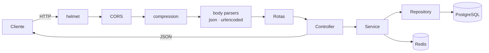

<div align="center">

# 🔧 mecUp API

### Workshop Management System — backend

_API robusta para gestão de oficinas mecânicas, construída com foco em segurança, testabilidade e padrões de mercado._

<br/>

[](https://nodejs.org)
[](https://www.typescriptlang.org)
[](https://expressjs.com)
[](https://www.postgresql.org)
[](https://redis.io)
[](https://www.docker.com)

[](https://zod.dev)
[](https://eslint.org)
[](https://prettier.io)
[](https://www.conventionalcommits.org)
[](https://pnpm.io)

</div>

---

## 📑 Sumário

- [✨ Destaques](#-destaques)
- [🧱 Stack](#-stack)
- [🏛️ Arquitetura](#️-arquitetura)
- [🔄 Ciclo de uma requisição](#-ciclo-de-uma-requisição)
- [✅ Pré-requisitos](#-pré-requisitos)
- [🚀 Começando](#-começando)
- [🐳 Rodando com Docker](#-rodando-com-docker)
- [🔐 Variáveis de ambiente](#-variáveis-de-ambiente)
- [📜 Scripts disponíveis](#-scripts-disponíveis)
- [🌐 Endpoints](#-endpoints)
- [🧹 Padrões de código & qualidade](#-padrões-de-código--qualidade)
- [🗺️ Roadmap](#️-roadmap)
- [👤 Autor](#-autor)

---

## ✨ Destaques

- 🛡️ **Seguro por padrão** — `helmet` com CSP travada, CORS por allowlist e `trust proxy` configurável.
- 🧪 **Testável sem subir porta** — separação entre `createApp()` (montagem) e `startServer()` (bootstrap).
- 🧬 **Configuração validada** — variáveis de ambiente checadas em runtime com **Zod**; a aplicação nem sobe com config inválida.
- 🛑 **Graceful shutdown** — drena conexões em andamento antes de encerrar (`SIGTERM`/`SIGINT`), com failsafe por timeout.
- 🗜️ **Performance** — respostas comprimidas com `compression`.
- 🧰 **DX de primeira** — ESLint (type-checked) + Prettier + Husky + Commitlint + lint-staged já configurados.

---

## 🧱 Stack

| Camada            | Tecnologia                                   |
| ----------------- | -------------------------------------------- |
| **Runtime**       | Node.js 22+                                  |
| **Linguagem**     | TypeScript (ESM → CommonJS)                  |
| **Framework HTTP**| Express 5                                    |
| **Validação**     | Zod                                          |
| **Banco**         | PostgreSQL 17 _(planejado via TypeORM)_      |
| **Cache**         | Redis 7                                      |
| **Infra**         | Docker + Docker Compose                      |
| **Gerenciador**   | pnpm                                         |
| **Qualidade**     | ESLint · Prettier · Husky · Commitlint       |

---

## 🏛️ Arquitetura

Padrão **modular monolith** com camadas por feature. A montagem da aplicação é desacoplada do bootstrap do servidor, permitindo testes de integração sem abrir porta.

```
src/
├── app.ts              # Factory createApp(): monta Express + middlewares globais
├── server.ts           # Bootstrap: sobe o HTTP server + graceful shutdown
│
├── config/
│   └── env.ts          # Validação das variáveis de ambiente com Zod
│
├── routes/
│   └── index.ts        # Registro central de rotas
│
├── modules/            # Domínios de negócio (1 pasta por feature)
│   └── users/
│       ├── controller/ # Entrada HTTP (req/res)
│       ├── service/    # Regras de negócio
│       ├── repository/ # Acesso a dados
│       ├── dto/        # Contratos de entrada/saída
│       ├── entity/     # Entidades (TypeORM)
│       └── routes/     # Rotas do módulo
│
├── database/           # data-source, migrations, seeds
└── shared/             # errors, middlewares, utils reutilizáveis
```

---

## 🔄 Ciclo de uma requisição



---

## ✅ Pré-requisitos

| Ferramenta | Versão mínima | Observação                              |
| ---------- | ------------- | --------------------------------------- |
| **Node.js**| `22+`         | Recomendado via [nvm](https://github.com/nvm-sh/nvm) |
| **pnpm**   | `11+`         | `npm install -g pnpm` ou `corepack enable` |
| **Docker** | _opcional_    | Para subir Postgres + Redis localmente  |

---

## 🚀 Começando

```bash
# 1. Clone o repositório
git clone https://github.com/Peixotim/mecUP-back.git
cd mecUP-back

# 2. Instale as dependências
pnpm install

# 3. Crie seu .env a partir do exemplo
cp .env.example .env
#   👉 edite o .env e troque as senhas/segredos

# 4. Suba a infraestrutura (Postgres + Redis)
docker compose up -d

# 5. Rode a API em modo desenvolvimento (hot reload)
pnpm dev
```

A API ficará disponível em **`http://localhost:8080`** (porta definida por `API_PORT`).

> 💡 Teste rápido: `curl http://localhost:8080/health`

---

## 🐳 Rodando com Docker

O `docker-compose.yaml` separa a infraestrutura da aplicação via _profiles_:

```bash
# Apenas infraestrutura (Postgres + Redis) — ideal para rodar a API com `pnpm dev`
docker compose up -d

# Infraestrutura + API com hot reload (profile "dev")
docker compose --profile dev up -d

# Acompanhar logs
docker compose logs -f

# Derrubar tudo
docker compose down
```

<details>
<summary><b>📦 Serviços provisionados</b></summary>

<br/>

| Serviço     | Imagem              | Porta | Healthcheck |
| ----------- | ------------------- | ----- | ----------- |
| `postgres`  | `postgres:17-alpine`| 5432  | `pg_isready`|
| `redis`     | `redis:7-alpine`    | 6379  | `redis-cli ping` |
| `api` _(dev)_ | build local        | 8080  | —           |

Volumes nomeados (`mecup_postgres_data`, `mecup_redis_data`) garantem persistência entre reinícios.

</details>

---

## 🔐 Variáveis de ambiente

Todas são validadas por [`src/config/env.ts`](src/config/env.ts) com Zod no startup. **Config inválida derruba a aplicação com mensagem clara** — falha rápido, falha cedo.

| Variável            | Obrigatória | Padrão        | Descrição                                                        |
| ------------------- | :---------: | ------------- | ---------------------------------------------------------------- |
| `NODE_ENV`          | —           | `development` | `development` · `test` · `production`                            |
| `API_PORT`          | —           | `8080`        | Porta HTTP da API                                                |
| `FRONTEND_URL`      | ✅          | —             | Origens liberadas no CORS (várias, separadas por vírgula)        |
| `CORS_CREDENTIALS`  | —           | `false`       | Habilita cookies/credenciais no CORS                             |
| `TRUST_PROXY`       | —           | `false`       | Confiança em `X-Forwarded-*` (`false`, `1`, `loopback`, …)       |
| `POSTGRES_USER`     | ✅          | —             | Usuário do Postgres                                              |
| `POSTGRES_PASSWORD` | ✅          | —             | Senha do Postgres                                                |
| `POSTGRES_DB`       | ✅          | —             | Nome do banco                                                    |
| `POSTGRES_HOST`     | ✅          | —             | `postgres` no Docker · `localhost` fora                          |
| `POSTGRES_PORT`     | —           | `5432`        | Porta do Postgres                                                |
| `DATABASE_URL`      | ✅          | —             | Connection string completa do Postgres                          |
| `REDIS_PASSWORD`    | ✅          | —             | Senha do Redis                                                   |
| `REDIS_HOST`        | ✅          | —             | `redis` no Docker · `localhost` fora                             |
| `REDIS_PORT`        | —           | `6379`        | Porta do Redis                                                   |
| `REDIS_URL`         | ✅          | —             | Connection string completa do Redis                             |

> ⚠️ **Nunca** versione o `.env`. Ele já está no `.gitignore`. Use o `.env.example` como referência.

---

## 📜 Scripts disponíveis

| Script              | Ação                                                  |
| ------------------- | ----------------------------------------------------- |
| `pnpm dev`          | Sobe a API com hot reload (`tsx watch`)               |
| `pnpm build`        | Compila o TypeScript para `dist/`                     |
| `pnpm start`        | Executa o build de produção (`node dist/server.js`)   |
| `pnpm typecheck`    | Checagem de tipos sem emitir arquivos                 |
| `pnpm lint`         | Roda o ESLint                                         |
| `pnpm lint:fix`     | ESLint com correção automática                        |
| `pnpm format`       | Formata o projeto com Prettier                        |
| `pnpm format:check` | Verifica formatação sem alterar                       |

---

## 🌐 Endpoints

| Método | Rota       | Descrição                  | Resposta |
| ------ | ---------- | -------------------------- | -------- |
| `GET`  | `/health`  | Health check / info da API | `200`    |

```jsonc
// GET /health → 200 OK
{
  "name": "mecUp API",
  "version": "1.0.0",
  "status": "ok"
}
```

> 🚧 Rotas de negócio (`/users`, …) entram conforme os módulos forem implementados.

---

## 🧹 Padrões de código & qualidade

Este projeto leva **DX e consistência a sério** — os hooks de Git garantem que nada fora do padrão entra no repositório.

- **Conventional Commits** validados pelo Commitlint (`commit-msg` hook).
- **lint-staged** roda ESLint + Prettier nos arquivos staged (`pre-commit` hook).
- **ESLint type-checked** com regras estritas (sem `any`, sem floating promises, imports ordenados).

```bash
# Formato de commit esperado
<type>(<scope>): <subject>

# Exemplos
feat(users): add user registration endpoint
fix(cors): allow multiple comma-separated origins
refactor(server): use try/catch in graceful shutdown
```

<details>
<summary><b>Tipos de commit aceitos</b></summary>

<br/>

`feat` · `fix` · `docs` · `style` · `refactor` · `perf` · `test` · `build` · `ci` · `chore` · `revert`

</details>

---

## 🗺️ Roadmap

- [x] Casca da aplicação (app/server, middlewares globais, graceful shutdown)
- [x] Validação de ambiente com Zod
- [x] Tooling de qualidade (ESLint, Prettier, Husky, Commitlint)
- [ ] Logging estruturado (pino)
- [ ] Error handler centralizado (`shared/errors`)
- [ ] Health/Readiness separados (`/health` vs `/ready`)
- [ ] Integração TypeORM + migrations
- [ ] Módulo `users` end-to-end (controller → service → repository)
- [ ] Autenticação (JWT) & rate limiting
- [ ] Suíte de testes (Vitest + Supertest)

---

## 👤 Autor

**Pedro Peixoto**

[](https://github.com/Peixotim)

<div align="center">

<br/>

_Feito com ⚙️ e cuidado de engenharia._

</div>
